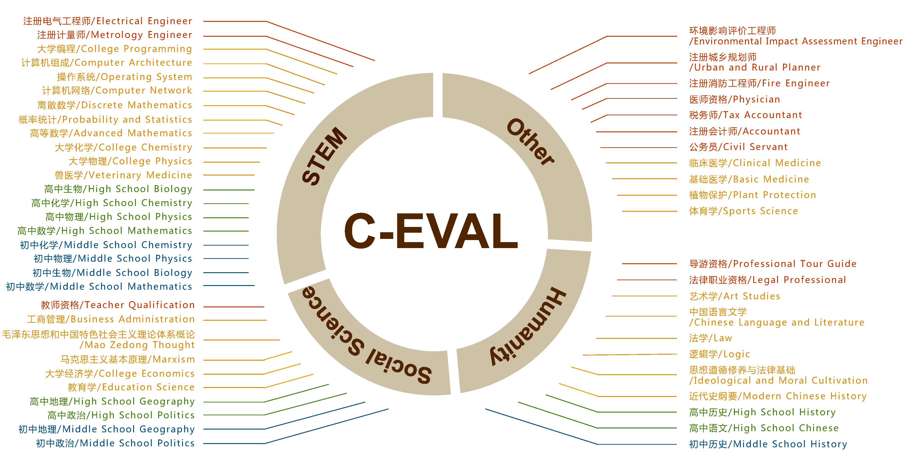

<p align="center">        </p>

<p align="center">
   🌐 <a href="https://cevalbenchmark.com/" target="_blank">网站</a> • 🤗 <a href="https://huggingface.co/datasets/ceval/ceval-exam" target="_blank">Hugging Face</a> • ⏬ <a href="#数据" target="_blank">数据</a> • 📃 <a href="https://arxiv.org/abs/2305.08322"" target="_blank">论文</a> 📖 <a href="resources/tutorial.md" target="_blank">教程</a> <br> <a href="https://github.com/SJTU-LIT/ceval/blob/main/README.md">English | <a href="https://github.com/SJTU-LIT/ceval/blob/main/README_zh.md">中文</a>
</p>


C-Eval是全面的中文基础模型评估套件，涵盖了52个不同学科的13948个多项选择题，分为四个难度级别，如下所示。更多详情，请访问我们的[网站](https://cevalbenchmark.com/)或查看我们的[论文](https://arxiv.org/abs/2305.08322)。

我们希望C-Eval能够帮助开发人员跟踪模型开发的进展，以及分析开发中模型的优点和弱点。

📝 [为什么我们要做C-Eval？具体怎么做的？](https://yaofu.notion.site/C-Eval-6b79edd91b454e3d8ea41c59ea2af873)




## 目录

- [排行榜](#排行榜)
- [C-Eval Hard 排行榜](#c-eval-hard-排行榜)
- [验证集结果](#验证集结果)
- [数据](#数据)
- [如何在C-Eval上测试](#如何在c-eval上测试)
- [如何提交](#如何提交)
- [TODO](#todo)
- [Licenses](#licenses)
- [引用](#引用)


## 排行榜

下面列出了我们在初始版本中进行评估的模型的zero-shot和five-shot准确率，请访问我们官方[排行榜](https://cevalbenchmark.com/static/leaderboard_zh.html)了解最新模型及其在每个学科中的详细结果。我们注意到对于许多指令微调之后的模型来说，zero-shot结果好于few-shot。

#### Zero-shot
| Model               | STEM | Social Science | Humanities | Other | Average |
| ------------------- | :--: | :------------: | :--------: | :---: | :-----: |
| GPT-4               | 65.2 |      74.7      |    62.5    | 64.7  |  66.4   |
| ChatGPT             | 49.0 |      58.0      |    48.8    | 50.4  |  51.0   |
| Claude-v1.3         | 48.5 |      58.6      |    47.3    | 50.1  |  50.5   |
| Bloomz-mt-176B           | 39.1 |      53.0      |    47.7    | 42.7  |  44.3   |
| GLM-130B            | 36.7 |      55.8      |    47.7    | 43.0  |  44.0   |
| Claude-instant-v1.0 | 38.6 |      47.6      |    39.5    | 39.0  |  40.6   |
| ChatGLM-6B          | 33.3 |      48.3      |    41.3    | 38.0  |  38.9   |
| LLaMA-65B           | 32.6 |      41.2      |    34.1    | 33.0  |  34.7   |
| MOSS                | 31.6 |      37.0      |    33.4    | 32.1  |  33.1   |
| Chinese-Alpaca-13B  | 27.4 |      39.2      |    32.5    | 28.0  |  30.9   |
| Chinese-LLaMA-13B   | 28.8 |      32.9      |    29.7    | 28.0  |  29.6   |

#### Five-shot
| Model               | STEM | Social Science | Humanities | Other | Average |
| ------------------- | :--: | :------------: | :--------: | :---: | :-----: |
| GPT-4               | 67.1 |      77.6      |    64.5    | 67.8  |  68.7   |
| ChatGPT             | 52.9 |      61.8      |    50.9    | 53.6  |  54.4   |
| Claude-v1.3         | 51.9 |      61.7      |    52.1    | 53.7  |  54.2   |
| Claude-instant-v1.0 | 43.1 |      53.8      |    44.2    | 45.4  |  45.9   |
| GLM-130B            | 34.8 |      48.7      |    43.3    | 39.8  |  40.3   |
| Bloomz-mt-176B      | 35.3 |      45.1      |    40.5    | 38.5  |  39.0   |
| LLaMA-65B           | 37.8 |      45.6      |    36.1    | 37.1  |  38.8   |
| ChatGLM-6B          | 30.4 |      39.6      |    37.4    | 34.5  |  34.5   |
| Chinese LLaMA-13B   | 31.6 |      37.2      |    33.6    | 32.8  |  33.3   |
| MOSS                | 28.6 |      36.8      |    31.0    | 30.3  |  31.1   |
| Chinese Alpaca-13B  | 26.0 |      27.2      |    27.8    | 26.4  |  26.7   |


## C-Eval Hard 排行榜

我们选取了C-Eval中具有挑战性的数学、物理和化学科目组成C-Eval Hard，包括：高等数学、离散数学、概率统计、大学化学、大学物理、高中数学、高中物理、高中化学八个科目。这些科目包含了复杂的LaTex公式，需要非凡的推理能力才能解决。以下是0-shot和5-shot的准确率。

| Model               | Zero-shot | Five-shot |
| ------------------- | :-------: | :-------: |
| GPT-4               |   53.3    |   54.9    |
| Claude-v1.3         |   37.6    |   39.0    |
| ChatGPT             |   36.7    |   41.4    |
| Claude-instant-v1.0 |   32.1    |   35.5    |
| Bloomz-mt           |   30.8    |   30.4    |
| GLM-130B            |   30.7    |   30.3    |
| LLaMA-65B           |   29.8    |   31.7    |
| ChatGLM-6B          |   29.2    |   23.1    |
| MOSS                |   28.4    |   24.0    |
| Chinese-LLaMA-13B   |   27.5    |   27.3    |
| Chinese-Alpaca-13B  |   24.4    |   27.1    |


## 验证集结果

因为我们不会公开发布测试数据集的标签，所以我们提供验证集的平均准确率作为参考。验证集总共有1346个问题。我们在下表中提供在所有科目上的0-shot和5-shot平均准确率。Val集的平均准确率与[排行榜](#排行榜)中呈现的平均测试准确率比较接近。

| Model               | Zero-shot | Five-shot |
| ------------------- | :-------: | :-------: |
| GPT-4               |   66.7    |   69.9    |
| Claude-v1.3         |   52.1    |   55.5    |
| ChatGPT             |   50.8    |   53.5    |
| Bloomz-mt           |   45.9    |   38.0    |
| GLM-130B            |   44.2    |   40.8    |
| Claude-instant-v1.0 |   43.2    |   47.4    |
| ChatGLM-6B          |   39.7    |   37.1    |
| LLaMA-65B           |   38.6    |   39.8    |
| MOSS                |   35.1    |   28.9    |
| Chinese-Alpaca-13B  |   32.0    |   27.2    |
| Chinese-LLaMA-13B   |   29.4    |   33.1    |


## 数据

#### 下载

* 方法一：下载zip压缩文件（你也可以直接用浏览器打开下面的链接）：
  ```
  wget https://huggingface.co/datasets/ceval/ceval-exam/blob/main/ceval-exam.zip
  ```
  然后可以使用 pandas加载数据：

  ```
  import os
  import pandas as pd
  
  File_Dir="ceval-exam"
  test_df=pd.read_csv(os.path.join(File_Dir,"test","computer_network_test.csv"))
  ```

* 方法二：使用[Hugging Face datasets](https://huggingface.co/datasets/ceval/ceval-exam)直接加载数据集。示例如下：

  ```python
  from datasets import load_dataset
  dataset=load_dataset(r"ceval/ceval-exam",name="computer_network")
  
  print(dataset['val'][0])
  # {'id': 0, 'question': '使用位填充方法，以01111110为位首flag，数据为011011111111111111110010，求问传送时要添加几个0____', 'A': '1', 'B': '2', 'C': '3', 'D': '4', 'answer': 'C', 'explanation': ''}
  ```

#### 说明
为了方便使用，我们已经整理出了与 52 个科目对应的学科名称处理程序以及它们的中英文名称。具体细节请查看 [subject_mapping.json](https://github.com/SJTU-LIT/ceval/blob/main/subject_mapping.json)。格式如下：

```
{
	"computer_network": [
		"Computer Network",
		"计算机网络",
		"STEM"
	],
	...
	"filename":[
	"英文名称",
	"中文名称"
	"类别(STEM,Social Science,Humanities,Other四选一)"
	]
}
```

每个科目由三个部分组成：dev、val 和 test。每个科目的 dev 集包含五个示范实例以及为 few-shot 评估提供的解释。val 集旨在用于超参数调整。而 test 集则用于模型评估。test 集上的标签不会公开，需要用户提交其结果才能自动获得测试准确性。[如何提交？](#如何提交) 

下面是高中化学的示例：

```
id: 1
question: 25 °C时，将pH=2的强酸溶液与pH=13的强碱溶液混合，所得混合液的pH=11，则强酸溶液与强碱溶液 的体积比是(忽略混合后溶液的体积变化)____
A: 11:1
B: 9:1
C: 1:11
D: 1:9
answer: B
explanation: 
1. pH=13的强碱溶液中c(OH-)=0.1mol/L, pH=2的强酸溶液中c(H+)=0.01mol/L，酸碱混合后pH=11，即c(OH-)=0.001mol/L。
2. 设强酸和强碱溶液的体积分别为x和y，则：c(OH-)=(0.1y-0.01x)/(x+y)=0.001，解得x:y=9:1。
```


## 如何在C-Eval上测试

通常你可以直接从模型的生成中使用正则表达式提取出答案选项（A,B,C,D)。在少样本测试中，模型通常会遵循少样本给出的固定格式，所以提取答案很简单。然而有时候，特别是零样本测试和面对没有做过指令微调的模型时，模型可能无法很好的理解指令，甚至有时不会回答问题。这种情况下我们推荐直接计算下一个预测token等于"A", "B", "C", "D"的概率，然后以概率最大的选项作为答案 -- 这是一种受限解码生成的方法，MMLU的[官方测试代码](https://github.com/hendrycks/test/blob/4450500f923c49f1fb1dd3d99108a0bd9717b660/evaluate.py#L88)中是使用了这种方法进行测试。注意这种概率方法对思维链的测试不适用。[更加详细的评测教程](resources/tutorial.md)。

在我们最初发布时，我们自己用了以下prompt进行测试：
#### 仅预测答案的prompt
```
以下是中国关于{科目}考试的单项选择题，请选出其中的正确答案。

{题目1}
A. {选项A}
B. {选项B}
C. {选项C}
D. {选项D}
答案：A

[k-shot demo, note that k is 0 in the zero-shot case]

{测试题目}
A. {选项A}
B. {选项B}
C. {选项C}
D. {选项D}
答案：
```

#### 思维链prompt
```
以下是中国关于{科目}考试的单项选择题，请选出其中的正确答案。

{题目1}
A. {选项A}
B. {选项B}
C. {选项C}
D. {选项D}
答案：让我们一步一步思考，
1. {解析过程步骤1}
2. {解析过程步骤2}
3. {解析过程步骤3}
所以答案是A。

[k-shot demo, note that k is 0 in the zero-shot case]

{测试题目}
A. {选项A}
B. {选项B}
C. {选项C}
D. {选项D}
答案：让我们一步一步思考，
1. 
```


## 如何提交

您首先需要准备一个 UTF-8 编码的 JSON 文件，并按照以下格式编写。详情请参考[submission_example.json](https://github.com/SJTU-LIT/ceval/blob/main/submission_example.json)。

```
## 每个学科内部的键名是数据集中的"id"字段
{
    "chinese_language_and_literature": {
        "0": "A",
        "1": "B",
        "2": "B",
        ...
    },
    
    "学科名称":{
    "0":"答案1",
    "1":"答案2",
    ...
    }
    ....
}
```

然后你可以将准备好的JSON文件提交到[这里](https://cevalbenchmark.com/static/user_interface_zh.html)，**请注意，你需要先登录才能访问提交页面**。


## TODO

- [x] 添加zero-shot结果
- [ ] 集成到openai eval


## Licenses

[](https://lbesson.mit-license.org/)

本项目遵循 [MIT License](https://lbesson.mit-license.org/).

[](http://creativecommons.org/licenses/by-nc-sa/4.0/)

C-Eval数据集遵循 [Creative Commons Attribution-NonCommercial-ShareAlike 4.0 International License](http://creativecommons.org/licenses/by-nc-sa/4.0/).


## 引用

如果您使用了我们的数据集，请引用我们的论文。

```
@article{huang2023ceval,
title={C-Eval: A Multi-Level Multi-Discipline Chinese Evaluation Suite for Foundation Models}, 
author={Huang, Yuzhen and Bai, Yuzhuo and Zhu, Zhihao and Zhang, Junlei and Zhang, Jinghan and Su, Tangjun and Liu, Junteng and Lv, Chuancheng and Zhang, Yikai and Lei, Jiayi and Fu, Yao and Sun, Maosong and He, Junxian},
journal={arXiv preprint arXiv:2305.08322},
year={2023}
}
```

