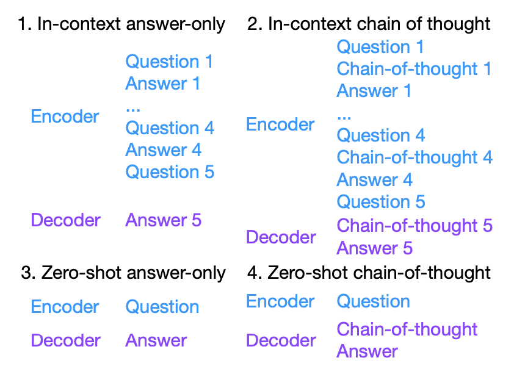

# 1. C-Eval 数据集评测简明教程
 
**目录** 


- [1. C-Eval 数据集评测简明教程](#1-c-eval-数据集评测简明教程)
- [2. 基础知识](#2-基础知识)
- [3. Prompt 的格式](#3-prompt-的格式)
  - [3.1. Completion 模式](#31-completion-模式)
  - [3.2. Chat 模式](#32-chat-模式)
- [4. Decoding 的方法](#4-decoding-的方法)
- [5. 以 few-shot 为准还是以 zero-shot 为准？](#5-以-few-shot-为准还是以-zero-shot-为准)
- [6. 是否需要做 prompt engineering](#6-是否需要做-prompt-engineering)
- [7. 理解 \[推理\] 和 \[知识\]](#7-理解-推理-和-知识)
- [8. 解读模型的分数](#8-解读模型的分数)


# 2. 基础知识

一般有四种 prompting 范式，见 [Fu et. al. 2023](https://arxiv.org/abs/2301.12726) Figure 1B
<p align="center">        </p>

* few-shot answer-only <- 推荐从这里开始
* few-shot chain-of-thought <- 一般 CoT 在模型超过 65B 之后才会显著有效
* zero-shot answer-only <- instruction tuning 之后用这个
* zero-shot chain-of-thought <- instruction tuning 之后且模型足够强，就用这个

新手模型推荐从 few-shot answer-only 开始

# 3. Prompt 的格式

prompt 的格式非常重要！！注意要换行！！注意每行末尾不要有空格

## 3.1. Completion 模式

如果模型还没有被调成一个 chatbot，那么：
```
以下是中国关于{subject}考试的单项选择题，请选出其中的正确答案。 <- 注意把 {subject} 改成具体的科目名称

[题目 1]
A. [选项 A 具体内容]
B. [选项 B 具体内容]
C. [选项 C 具体内容]
D. [选项 D 具体内容]
答案：A              

...                 <- 题目 2 到 4

[题目 5]
A. [选项 A 具体内容]
B. [选项 B 具体内容]
C. [选项 C 具体内容]
D. [选项 D 具体内容]
答案：C

[测试题目]
A. [选项 A 具体内容]
B. [选项 B 具体内容]
C. [选项 C 具体内容]
D. [选项 D 具体内容]
答案：<模型从此处生成>
```

* 上面是 in-context answer-only 格式的 prompt。如果是 zero-shot 的话，则去掉 [题目 1] 到 [题目 5] 的 in-context 样本
* 如果模型的 context length 装不下所有的 in-context examples，则去掉一两个
* 如果是 chain-of-thought 的话，则需要加上 {让我们一步一步思考 [explanation]} 的内容，如下：

以下是 few-shot chain-of-thought prompt 的格式

```
以下是中国关于{subject}考试的单项选择题，请选出其中的正确答案。 <- 注意把 {subject} 改成具体的科目名称

[题目 1]
A. [选项 A 具体内容]
B. [选项 B 具体内容]
C. [选项 C 具体内容]
D. [选项 D 具体内容]
答案：让我们一步一步思考，
1. {解析过程步骤1}
2. {解析过程步骤2}
3. {解析过程步骤3}
所以答案是A。

...      <- 题目 2 到 4

[题目 5]
A. [选项 A 具体内容]
B. [选项 B 具体内容]
C. [选项 C 具体内容]
D. [选项 D 具体内容]
答案：让我们一步一步思考，
1. {解析过程步骤1}
2. {解析过程步骤2}
所以答案是C。

[测试题目]
A. [选项 A 具体内容]
B. [选项 B 具体内容]
C. [选项 C 具体内容]
D. [选项 D 具体内容]
答案：让我们一步一步思考，
<模型从此处生成>
```

## 3.2. Chat 模式

如果模型已经调成一个 chatbot，那么 prompt 也需要改成对话的格式：
```
System:
以下是中国关于{subject}考试的单项选择题，请选出其中的正确答案。  <- 注意这个初始 instruction 是以 system message 的格式传入的；如果当前模型不支持 system，则把它放在第一轮对话的开头然后换行

User:
[题目 1]
A. [选项 A 具体内容]
B. [选项 B 具体内容]
C. [选项 C 具体内容]
D. [选项 D 具体内容]
答案：

Assistant:
A       <- 注意这个地方不是模型生成的，而是我们 hard code 作为输入的


...                 <- 题目 2 到 4

User:
[题目 5]
A. [选项 A 具体内容]
B. [选项 B 具体内容]
C. [选项 C 具体内容]
D. [选项 D 具体内容]
答案：

Assistant:
C       <- Again，这个地方不是模型生成的，而是我们 hard code 作为输入的

User:
[测试题目]
A. [选项 A 具体内容]
B. [选项 B 具体内容]
C. [选项 C 具体内容]
D. [选项 D 具体内容]
答案：

Assistant:
<模型从此处生成>
```

* 对话格式的 prompt 相当于我们让 AI 假装已经正确回答了五个问题（但实际上是被我们 hard code 到 prompt 里的），然后 AI 实际上只回答最后一轮的问题
* 相应的，对话格式的 zero-shot 和 chain-of-thought 版本的 prompt 需要分别去掉 in-context 样本和加上{让我们一步一步思考 [explanation]} 的内容
* Again，推荐使用 in-context answer-only 作为起点

更多关于 reasoning/ chain-of-thought 的内容，参见博客 [Towards Complex Reasoning: the Polaris of Large Language Models](https://tinyurl.com/67c2eazt)

# 4. Decoding 的方法

* 测试的时候一般 temperature 设置为 0 做 greedy decoding，因为这种 variance 低
* 大模型一般不用 beam search，贵且作用不大
* 上线一般用 sampling，因为用户友好，说错了可以再说一遍

# 5. 以 few-shot 为准还是以 zero-shot 为准？

* 一般来说，pretraining阶段的模型few-shot 的效果总是会比 zero-shot 好一些，但是经过instruction tuning之后的模型，且instruction tuning没有few-shot data的话，很可能zero-shot会更好
* Few-shot 是面向开发者的，因为在构造基于 LLM 的应用的时候，开发者总是希望用 prompt engineering 的方法进一步提升模型的效果
  * 在这种情况下，模型相当于一个操作系统
* Zero-shot 是面向用户的，因为用户没工夫写 prompt 
  * 在这种情况下，模型相当于一个 Chatbot
* 我们建议开发两个版本，一个面向开发者，把 in-context learning 的能力拉满，另一个面向用户，把 zero-shot 的能力拉满

# 6. 是否需要做 prompt engineering 

对于 pretrained checkpoint (没有经过 instruction tuning) 
* prompt 的不同会得到很不同的效果
* 我们给定了 default prompt，这个 prompt 不一定是最优的
* 在实际操作的过程中，需要区分分数的提高是来自于模型的提升还是来自于 prompt 的提升
* 如果目标是开发模型，则推荐不要做太多的 prompt 优化

对于 instruction-tuned checkpoint
* prompt 的差异导致模型效果的 variance 会减小，但是也无法忽略
* 经过了 instruction tuning 之后，模型对 prompt engineering 的需求会减小，但是仍然存在

所以推荐报两份结果，一份是使用我们 dev 文件夹里的数据作为 default prompt 报一次结果，此结果看作 baseline；另一份是根据自己的模型做 prompt engineering 然后报一次结果，此结果看作 upper bound 

# 7. 理解 [推理] 和 [知识]

大模型测测试题目一般分推理和知识两种类型：
* 有些题目天生不需要 reasoning，比如中国语言文学里面一个是 “《茶馆》的作者是谁”，这种不需要 CoT，直接 AO 即可，CoT 反而增加了 distractor 
* 有些题目天生需要 reasoning，比如求定积分，这种直接给答案基本上都是随着直觉瞎猜，还是得一步一步推
* 一般而言，知识性的问题不大需要 CoT，推理型的问题需要 CoT 
* MMLU 是一个典型的知识型数据集，所以 PaLM 在这上面 AO 比 CoT 好
* BBH 是一个典型的推理型数据集，这上面 CoT 显著好于 AO
* 在 Ceval 中，文科科目比较偏知识，理科科目比较偏推理
* 在 Ceval 上理科 CoT 和 AO 效果差不多，但这并不意味着 CoT 没有用，而是因为模型在 CoT 的时候需要能推公式，但现在很多模型做不到这件事情。因此，如果能够增加公式推导中间过程的准确性（例如 OpenAI [Let's Verify Step by Step](https://arxiv.org/abs/2305.20050)），我们预测 CoT 的效果会比 AO 好很多

[知识] 和 [推理] 是两项可以显著区分大小模型的能力，其中
* [推理] 能力的区分度是最高的，比如说 gsm8k 这个数据集，GPT4 92 分，LLaMA 7b 只有七分，模型每大一点基本上都是十几二十分的差距
* [知识] 的区分度没有 [推理] 这么高，但也很高； 这里面模型每大一个台阶基本上是五六分的差距
* [推理] 能力小的模型基本没有，很多时候 acc 只有个位数
* [知识] 能力小模型也会有一点，比如 MMLU 上 11B flant5 也有 40+

关于英文推理能力的 benchmark，参见 [chain-of-thought-hub](https://github.com/FranxYao/chain-of-thought-hub)


# 8. 解读模型的分数

* 四选一，所以 baseline 是 25 分
* 但是模型没训练好的话可能低于 25 分
* CoT 不一定能显著提升模型分数因为只有在推理数据类任务上，模型强到一定程度之后，CoT 才会有效，这也是为什么 CoT 是一个典型的涌现能力
* CoT 的模式下，目前只评价最终答案对不对，不评价中间过程对不对，这是因为中间过程和最终答案在大部分时候显著正相关，最终答案对了，中间不会错到哪里去；中间错的多了，最终答案不会对；这种做法可以绕开中间过程难以评价的问题
* 单个科目平均只有 200-300 道题，所以在这上面效果超过 5 个点才能算显著；总的科目有 15k 的题目，这上面效果超过 2 个点可以认为显著
* 具体的分数的显著性还跟模型天生的 variance 相关，因此推荐多跑实验观察
